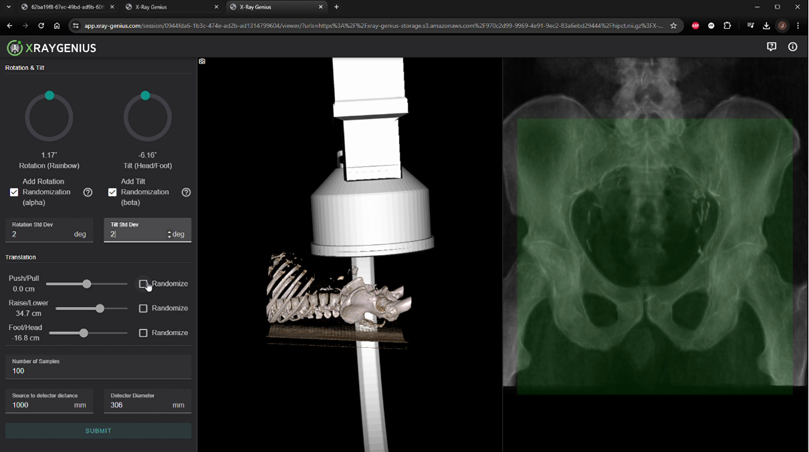

# X-ray Genius

X-ray Genius is a web-based application that leverages modern simulation pipelines to generate **Digitally Reconstructed Radiographs (DRRs)** from input CT images.  

- 🏥 **Clinical utility:** generates X-ray images from CT scans for orthopedic, surgical planning, radiation therapy, and other medical applications where X-ray imaging is unavailable or unarchived.  
- 🌐 **Web-based:** accessible through a modern web interface with containerized deployment.  
- ⚙️ **Modular & customizable:** designed to support **AI/ML biomedical research pipelines**.

  

## 📺 Demo & Resources

### Webinar
Watch our webinar discussing X-ray Genius and its applications in medical imaging:

[🎥 **X-ray Genius Webinar**](https://youtu.be/tnVnI_sslZs?si=5rY2p9k0rJ55gZBU)

### Screenshot

*X-ray Genius web interface showing DRR generation from CT data*

---

## 📋 Table of Contents
- [✨ Features](#-features)  
- [🚀 Quick Start](#-quick-start)
- [🐳 Develop with Docker (Recommended)](#-develop-with-docker-recommended)
- [💻 Develop Natively (Advanced)](#-develop-natively-advanced)
- [🧪 Testing](#-testing)
- [📋 Requirements](#-requirements)
- [☁️ Cloud Deployment Notes](#️-cloud-deployment-notes)
- [� Contributing](#-contributing)
- [📋 Requirements](#-requirements)
- [🤝 Contributing](#-contributing)
- [📄 License](#-license)
- [🏥 Medical Disclaimer](#-medical-disclaimer)

---

## ✨ Features
- Generate **synthetic X-rays (DRRs)** directly from CT data  
- **Web-based interface** with containerized deployment using Docker Compose
- GPU-accelerated computation (CUDA required for simulations)  
- Modular design for extension and integration into AI pipelines  

---

## 🚀 Quick Start

### Prepare the repository 
1. `git clone <repo-url>`

2. `cd <repo-folder>`

3. `git submodule update --init --recursive`

## 🐳 Develop with Docker (Recommended)
This is the simplest configuration for developers to start with.

### Initial Setup
1. **Note**: Ensure that you clone the repository with submodules. If you've already cloned it without submodules, run `git submodule update --init --recursive`.
2. Install Nvidia GPU drivers, cuda (<=11), and the `nvidia-container-toolkit` if they are not already installed.
   - You can verify that the `nvidia-container-toolkit` is installed by running `nvidia-ctk --version`.
3. Run `docker compose run --rm django ./manage.py migrate`
4. Run `docker compose run --rm django ./manage.py createsuperuser`
   and follow the prompts to create your own user
5. Optionally, run `docker compose run --rm django ./manage.py load_test_data` to load some sample data into your system.
   
### Run Application
1. Run `docker compose up`
2. Access the site, starting at http://localhost:8000/admin/
3. When finished, use `Ctrl+C`

### Application Maintenance
Occasionally, new package dependencies or schema changes will necessitate
maintenance. To non-destructively update your development stack at any time:
1. Run `docker compose pull`
2. Run `docker compose build --pull --no-cache`
3. Run `docker compose run --rm django ./manage.py migrate`

## 💻 Develop Natively (Advanced)
This configuration still uses Docker to run attached services in the background,
but allows developers to run Python code on their native system.

### Initial Setup
1. **Note**: Ensure that you clone the repository with submodules. If you've already cloned it without submodules, run `git submodule update --init --recursive`.
2. Run `docker compose -f ./docker-compose.yml up -d`
3. Install Python 3.12 and Node.js 18
4. Install
   [`psycopg2` build prerequisites](https://www.psycopg.org/docs/install.html#build-prerequisites)
5. Install Nvidia GPU drivers and cuda (<=11) if they are not already installed.
6. Create and activate a new Python virtualenv
7. Run `pip install -r requirements.dev.txt -r requirements.worker.txt`
   1. If you have multiple versions of CUDA installed, you must ensure that this `pip install` command uses CUDA <= 11 to build `pycuda`. e.g. something like `CUDA_ROOT=/usr/local/cuda-11.5 PATH=/usr/local/cuda-11.5/bin:$PATH pip install pycuda==2025.1`
8. Run `source ./dev/export-env.sh`
9. Run `./manage.py migrate`
10. Run `npm ci`
11. Run `cd viewer && npm install && npm run build`
12. Run `cd ..` 
13. Run `./manage.py createsuperuser` and follow the prompts to create your own user

### Run Application
1.  Ensure `docker compose -f ./docker-compose.yml up -d` is still active
2. Run:
   1. `source ./dev/export-env.sh`
   2. `./manage.py runserver`
3. Run in a separate terminal:
   1. `source ./dev/export-env.sh`
   2. `celery --app xray_genius.celery worker --loglevel INFO --pool solo`
4. Run in a separate terminal:
   1. `npm start`
5. Optionally, run `./manage.py load_test_data` to load some sample data into your system.
6. When finished, run `docker compose stop`
7. To destroy the stack and start fresh, run `docker compose down -v`

## 🧪 Testing
### Initial Setup
tox is used to execute all tests.
tox is installed automatically with the `dev` package extra.

When running the "Develop with Docker" configuration, all tox commands must be run as
`docker compose run --rm django tox`; extra arguments may also be appended to this form.

### Running Tests
Run `tox` to launch the full test suite.

Individual test environments may be selectively run.
This also allows additional options to be be added.
Useful sub-commands include:
* `tox -e lint`: Run only the style checks
* `tox -e type`: Run only the type checks
* `tox -e test`: Run only the pytest-driven tests

To automatically reformat all code to comply with
some (but not all) of the style checks, run `tox -e format`.

## 📋 Requirements

### System Requirements
- **GPU**: NVIDIA GPU with CUDA support (CUDA ≤ 11)
- **OS**: Linux, macOS, or Windows with WSL2
- **Docker**: Docker and Docker Compose
- **Python**: 3.12+ (for native development)
- **Node.js**: 18+ (for native development)

### Hardware Recommendations
- **GPU Memory**: 8GB+ VRAM recommended for processing large CT volumes
- **RAM**: 16GB+ system memory
- **Storage**: 50GB+ available space for Docker images and data

---

## 🚀 Production Deployment

> **Note**: While Kitware has deployed X-ray Genius in production using AWS (Heroku + EC2 + S3), the cloud deployment infrastructure and operational procedures are **not included** in this open-source distribution. This repository provides the application code for **local development and testing** using Docker Compose.
> 
> For production cloud deployment, organizations will need to implement their own infrastructure setup. The containerized architecture makes it suitable for various cloud platforms.

---

## 🤝 Contributing

We welcome contributions! Please feel free to:
- Submit bug reports and feature requests via [GitHub Issues](https://github.com/KitwareMedical/x-ray-genius/issues)
- Fork the repository and submit pull requests
- Improve documentation and examples

### Development Workflow
1. Fork the repository
2. Create a feature branch (`git checkout -b feature/amazing-feature`)
3. Commit your changes (`git commit -m 'Add amazing feature'`)
4. Push to the branch (`git push origin feature/amazing-feature`)
5. Open a Pull Request

## 📄 License

This project is licensed under the [LICENSE](LICENSE) file in the repository.

## 🏥 Medical Disclaimer

X-ray Genius is a research tool intended for educational and research purposes. It is not intended for clinical diagnosis or treatment decisions. Always consult with qualified medical professionals for any medical-related applications.
